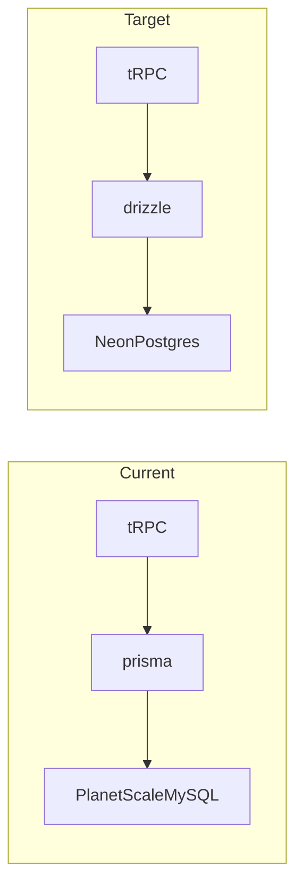

# Prisma + PlanetScale → Drizzle + Neon (fresh DB)

## Current state

- Schema: single `Post` model in `[prisma/schema.prisma](prisma/schema.prisma)` (MySQL, `relationMode = "prisma"` — PlanetScale pattern)
- DB access: `[src/server/db.ts](src/server/db.ts)` exports `prisma`
- Consumers: `[src/server/api/trpc.ts](src/server/api/trpc.ts)` (`ctx.prisma`), `[src/server/api/routers/posts.ts](src/server/api/routers/posts.ts)` (4 queries), `[src/server/api/helpers/ssgHelper.ts](src/server/api/helpers/ssgHelper.ts)`
- Env: `[src/env.mjs](src/env.mjs)` already validates `DATABASE_URL` as a URL



## Dependencies

**Add:**

- `drizzle-orm`
- `drizzle-kit` (dev)
- `@neondatabase/serverless` (Neon HTTP driver — fits Next.js serverless)

**Remove:**

- `@prisma/client`, `prisma`
- `postinstall: prisma generate` from `[package.json](package.json)`

**Scripts to add:**

- `db:generate` — `drizzle-kit generate`
- `db:migrate` — `drizzle-kit migrate`
- `db:push` — `drizzle-kit push` (handy for dev on fresh Neon)

## Schema and config (new files)

1. `**drizzle.config.ts`** — point at Neon `DATABASE_URL`, schema path `src/db/schema.ts`, dialect `postgresql`, output `drizzle/`
2. `**src/db/schema.ts`** — Drizzle equivalent of `Post`:
  - `id` — `text`, primary key, cuid default (`@paralleldrive/cuid2` or keep cuid via app layer)
  - `createdAt` — `timestamp`, default now
  - `content` — `varchar(255)`
  - `authorId` — `text` + index on `authorId`
3. `**src/server/db.ts`** — replace Prisma client with Neon + Drizzle:

```ts
import { neon } from "@neondatabase/serverless";
import { drizzle } from "drizzle-orm/neon-http";
import * as schema from "~/db/schema";

const sql = neon(process.env.DATABASE_URL!);
export const db = drizzle(sql, { schema });
```

   Keep dev singleton pattern (attach `db` to `globalThis` in non-production) like current Prisma setup.

## Application rewrites

| File                                                                         | Change                                                                                                                       |
| ---------------------------------------------------------------------------- | ---------------------------------------------------------------------------------------------------------------------------- |
| `[src/server/api/trpc.ts](src/server/api/trpc.ts)`                           | `import { db }` → `ctx: { db, userId }`                                                                                      |
| `[src/server/api/routers/posts.ts](src/server/api/routers/posts.ts)`         | Replace `ctx.prisma.post.*` with Drizzle `db.query.posts` / `db.insert` / `db.select`; import `Post` type from `~/db/schema` |
| `[src/server/api/helpers/ssgHelper.ts](src/server/api/helpers/ssgHelper.ts)` | Pass `db` instead of `prisma`                                                                                                |
| `[src/env.mjs](src/env.mjs)`                                                 | No structural change if `DATABASE_URL` stays; optional comment that Neon Postgres URL is expected                            |

**Query mapping (posts router):**

- `findMany` + `orderBy` + `take` → `db.select().from(posts).orderBy(desc(posts.createdAt)).limit(100)`
- `create` → `db.insert(posts).values({...}).returning()`
- `findUnique` → `db.select().where(eq(posts.id, id)).limit(1)`

## Cleanup

- Delete `[prisma/](prisma/)` directory and `[prisma/schema.prisma](prisma/schema.prisma)`
- Update `[.env.example](.env.example)`: Neon Postgres URL template + remove Prisma sqlite placeholder
- Update `[.gitignore](.gitignore)`: remove Prisma sqlite paths; add `drizzle/meta` if needed
- Update `[README.md](README.md)`: Prisma → Drizzle, PlanetScale → Neon

## Neon setup (manual, outside repo)

1. Create a Neon project and database
2. Copy pooled connection string into `.env` as `DATABASE_URL`
3. Run `npm run db:push` (or `db:migrate`) against the fresh Neon DB

## Verification

- `npm run typecheck`
- `npm audit` (should remain clean)
- `npm run build` with valid `.env` (Clerk + Neon + Upstash)
- Smoke test: create post, list feed, `getById`, profile lookup

## Risk notes

- **MySQL → Postgres** is a provider change, not a drop-in ORM swap; table/column naming will follow Drizzle defaults (can match `Post` table name via `pgTable("Post", ...)` to minimize surprises).
- **No data migration** — existing PlanetScale data will not move automatically.
